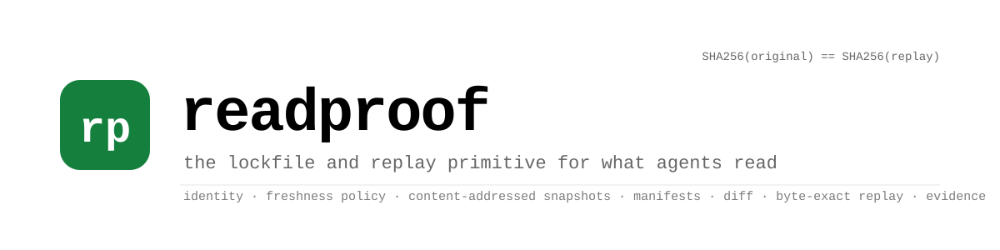
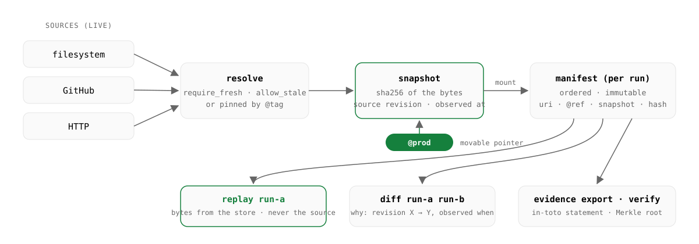

<p align="center">
  <picture>
    <source media="(prefers-color-scheme: dark)" srcset="docs/assets/banner-dark.svg">
    
  </picture>
</p>

<p align="center">
  <a href="https://github.com/fbzz/readproof/actions/workflows/ci.yml"></a>
  <a href="https://github.com/fbzz/readproof/actions/workflows/dsh-plugin.yml"></a>
  <a href="CHANGELOG.md"></a>
  <a href="LICENSE"></a>
  
  <a href="https://fbzz.github.io/readproof/"></a>
</p>

<p align="center">
  <a href="https://fbzz.github.io/readproof/">Website</a> ·
  <a href="https://fbzz.github.io/readproof/docs/">Docs</a> ·
  <a href="#install">Install</a> ·
  <a href="#quickstart">Quickstart</a> ·
  <a href="examples/support-agent/">Example agent</a> ·
  <a href="docs/mcp.md">MCP</a> ·
  <a href="integrations/deepseek-harness/dsh-plugin-readproof/README.md">DeepSeek Harness</a> ·
  <a href="docs/roadmap.md">Roadmap</a>
</p>

---

**Readproof gives every document an AI agent reads a stable identity, a freshness policy, and a content-addressed snapshot — and records every run as a manifest you can diff, replay byte for byte without touching the live source, and hand over as evidence.**

> Models are probabilistic, but many context failures are infrastructural.
> Agent reliability is bounded by context reliability.

It is not a vector database, not an observability tool, not a prompt registry, not a memory system. It sits underneath those and makes their inputs reproducible. Install-time lockfiles (Microsoft APM, `skills-lock.json`) pin an agent's *static* configuration; Readproof pins the *runtime documents, per run*.

## Sixty seconds, end to end

**1. Give a document an identity and a freshness policy, then record a run.**

```text
readproof resource add readproof://demo/policies/refunds \
  --source-type filesystem --path policies/refunds.md --policy require_fresh
readproof run --id run-a readproof://demo/policies/refunds
```
```text
Committed manifest manifest_01M0GQH8K8… for run run-a (1 entry)
```

**2. The source changes. A later run picks it up — and the diff says exactly why.**

```text
printf 'Products can be refunded within 14 days.\n' > policies/refunds.md
readproof run --id run-b readproof://demo/policies/refunds
readproof diff run-a run-b
```
```text
~ readproof://demo/policies/refunds
  why: source revision sha256:c8b0bb212e93 → sha256:8f4b00474456
  -Products can be refunded within 30 days.
  +Products can be refunded within 14 days.
```

**3. Replay the first run from the store — the file is gone or changed, the bytes are not — and prove it.**

```text
readproof replay run-a
readproof evidence export run-a --with-content --out bundle.json
readproof evidence verify bundle.json
```
```text
Products can be refunded within 30 days.
Replay verified: SHA256 match for 1/1 entries.
evidence verified: 1 entry, merkle root a9b73469f1a6…, replay match 1/1
```

`SHA256(original) == SHA256(replay)` is a test, not a slogan: the reference demo asserts it over SQLite, over Postgres + MinIO, and over a real HTTP round trip ([`examples/refund-agent`](examples/refund-agent)).

## Why

| Failure you have seen | What Readproof does about it |
| --- | --- |
| **"It worked on Tuesday."** A policy, price table, or runbook changed and the agent quietly answered from a different version. | Every run records which revision of each document it read; `readproof diff run-a run-b` names the source revision and observation time that changed, then prints the unified diff. |
| **"Can you rerun exactly that?"** Tracing tools keep strings; they cannot hand you the bytes again once the source moved. | `readproof replay` rebuilds a run's inputs from the content-addressed store and re-verifies every hash — no network, no source. Strict: any mismatch exits non-zero. |
| **"What data did the agent consider?"** EU AI Act Art. 12 logging (Annex III, from 2 Aug 2026) and SOC 2 reviews ask exactly this. | `readproof evidence export` writes an in-toto Statement whose subject is a Merkle root over the run; `verify` checks it anywhere. Not legal advice — but it is the record. |

## How it works

<p align="center">
  <picture>
    <source media="(prefers-color-scheme: dark)" srcset="docs/assets/how-it-works-dark.svg">
    
  </picture>
</p>

- **Identity** — `readproof://<namespace>/<path>`, independent of where the bytes live.
- **Policy** — `require_fresh` (re-verify every resolve), `allow_stale --max-age` (reuse within a TTL), or pin a reviewed snapshot by **tag**: `…@prod` delivers exactly that snapshot, no fetch, policy not consulted. Promotion is one pointer move; it is recorded and revertible.
- **Snapshot** — immutable, content-addressed; identical bytes dedupe to one blob.
- **Manifest** — the ordered list of what a run was delivered, by hash; entries record the `ref` they were mounted by, so moving a tag later can never change what a committed manifest replays.
- **Evidence** — derived from a manifest on demand; the Go CLI and the TypeScript SDK produce byte-identical bundles, and the same Merkle root appears on the run's OpenTelemetry span.

Deep dive: [`docs/architecture.md`](docs/architecture.md).

## Quickstart

### Install

```bash
# Go 1.26+ — lands in $(go env GOPATH)/bin
go install github.com/fbzz/readproof/cmd/readproof@latest
go install github.com/fbzz/readproof/cmd/readproofd@latest   # only if you run the server

# macOS — the cask installs both binaries
brew install fbzz/tap/readproof
```

Or download a prebuilt archive for your platform from
[GitHub Releases](https://github.com/fbzz/readproof/releases):
`readproof_<version>_<os>_<arch>.tar.gz` (`.zip` on Windows) contains
`readproof`, `readproofd`, `LICENSE`, `NOTICE`, and this README.

> Plainly: all three work once this repository is public and the first
> release is cut. Until then, build from source — which is what the
> embedded walkthrough below does anyway.

### Embedded mode

One binary, a local `.readproof/` directory, no services:

```bash
git clone https://github.com/fbzz/readproof.git
cd readproof
go build -o readproof ./cmd/readproof        # Go 1.26+

# identity + source + freshness policy
./readproof resource add readproof://demo/policies/refunds \
  --source-type filesystem \
  --path examples/refund-agent/policies/refunds.md \
  --policy require_fresh

./readproof run --id run-a readproof://demo/policies/refunds
./readproof replay run-a
```

### Client/server mode

Postgres + S3-compatible store, one HTTP API for every client:

```bash
# Postgres, MinIO, an OTel collector and readproofd, from a clean clone
cp .env.example .env
docker compose up -d --build

# every command now talks to the server
export READPROOF_SERVER_URL=http://localhost:8080
./readproof get readproof://demo/policies/refunds
```

> A containerized `readproofd` cannot see your host filesystem; use GitHub/HTTP sources there, or run `readproofd` on the host:
>
> ```bash
> # --filesystem-root allow-lists the directories a filesystem source may read.
> # Without one, readproofd refuses filesystem sources outright — registering a
> # resource would otherwise let any caller read any file the server can.
> readproofd --data-dir ~/.readproof --filesystem-root "$PWD"
> ```
>
> The same default-deny applies to `${VAR}` headers (`--header-env-allow NAME`) and to private network targets (`--allow-private-sources`). None of it applies to the embedded CLI, which reads your own files as you. See [`docs/api.md`](docs/api.md) and [`SECURITY.md`](SECURITY.md).

## Add it to your coding agent

Two minutes, either path — or both.

**A. Give the agent the tools (MCP).**

```bash
# Claude Code
claude mcp add readproof -- readproof mcp --data-dir ~/.readproof
# DeepSeek Harness
dsh plugin --profile web add ./integrations/deepseek-harness/dsh-plugin-readproof && dsh web
# Cursor / Claude Desktop (mcpServers):
#   {"command": "readproof", "args": ["mcp", "--data-dir", "~/.readproof"]}
```

The agent gets `readproof_resolve`, `readproof_run_*`, `readproof_diff`, `readproof_replay`, `readproof_tag_*`, `readproof_evidence_export`; every `resources/read` carries provenance in `_meta`. Details: [`docs/mcp.md`](docs/mcp.md).

**B. Give the agent the habit (skill).** Install the skill file, or paste the block below into `CLAUDE.md`, `AGENTS.md`, or `.cursor/rules/readproof.mdc`.

```bash
mkdir -p .claude/skills/readproof && curl -fsSL \
  https://raw.githubusercontent.com/fbzz/readproof/main/skills/readproof/SKILL.md \
  -o .claude/skills/readproof/SKILL.md
```

```markdown
## Readproof — record exactly what you read
When a task reads a document that must be reproducible (policies, runbooks,
specs, prices), read it through Readproof, never directly:
1. `readproof run start <task-id>`
2. `readproof run mount <task-id> readproof://<ns>/<path>[@prod]`  ← use the bytes it prints
3. `readproof run commit <task-id>`  → put the manifest id in your output / PR / ticket
Single shot: `readproof run --id <task-id> <uri> <uri>…`
Register once: `readproof resource add readproof://<ns>/<path>
  --source-type filesystem|github|http … --policy require_fresh|allow_stale`
Explain a change: `readproof diff <a> <b>`
Reproduce:        `readproof replay <id>`
Prove:            `readproof evidence export <id> --out bundle.json`
                  `readproof evidence verify bundle.json`
Deploy a document by moving a tag (`readproof tag set <uri> prod <snapshot>`),
never by editing the file in place. Never paste secrets into resource
definitions (use `${ENV_VAR}` headers); never touch the data directory by hand.
```

Full version with setup, policies, and the do-nots: [`skills/readproof/SKILL.md`](skills/readproof/SKILL.md).

## What you get

| | |
| --- | --- |
| **CLI** `readproof` | `resource` · `get` · `inspect` · `history` · `run` · `manifest` · `diff` · `replay` · `tag` · `evidence` · `mcp` — identical embedded or with `--server` |
| **Server** `readproofd` | JSON API (`/v1/resources`, `/v1/tags`, `/v1/resolve`, `/v1/runs`, `/v1/manifests`, `/v1/diff`, `/v1/replay`), optional bearer auth, SQLite or Postgres + S3 |
| **MCP server** `readproof mcp` | resources as `readproof://` URIs with provenance in `_meta`, 13 tools — Claude Code, Claude Desktop, Cursor ([`docs/mcp.md`](docs/mcp.md)) |
| **DeepSeek Harness plugin** | native bundle registering the same 13 tools, one Readproof run per DSH session, plus a zero-code MCP overlay ([`integrations/deepseek-harness`](integrations/deepseek-harness/dsh-plugin-readproof/README.md)) |
| **TypeScript SDK** `@readproof/sdk` | typed, zero-dependency client; `run().mount()…commit()`, tags, diff, replay, `buildEvidence()` ([`sdk/typescript`](sdk/typescript/README.md)) |
| **OpenTelemetry** | every pipeline stage traced; GenAI attributes (`gen_ai.data_source.id`); the commit span carries the evidence Merkle root; content never attached ([`docs/observability.md`](docs/observability.md)) |
| **Evidence** | in-toto Statement v1, Merkle root over entries, redacted resource definitions, replay check; `verify` works offline ([`docs/evidence.md`](docs/evidence.md)) |

## Examples

| | |
| --- | --- |
| [`examples/support-agent`](examples/support-agent) | A support agent on an **open model via Ollama** — one run per ticket, the policy changes, `diff` explains, `replay` returns the old bytes, the Go CLI verifies the evidence, a pinned `@prod` house style stays put. `npm run scenario`. [Guide](https://fbzz.github.io/readproof/examples/support-agent/). |
| [`examples/langgraph-ts`](examples/langgraph-ts) | LangGraph.js: mount inside a node, store the manifest id in the checkpoint, replay from it. |
| [`examples/refund-agent`](examples/refund-agent) | The reference walkthrough of the invariant, driven from the shell; the automated version runs in `go test ./...`. |

## Documentation

| | |
| --- | --- |
| [Website](https://fbzz.github.io/readproof/) · [Docs](https://fbzz.github.io/readproof/docs/) | Guide-style documentation for the whole surface |
| [`docs/architecture.md`](docs/architecture.md) | Data model, internals, CLI and HTTP reference, SDK, observability, tests |
| [`docs/api.md`](docs/api.md) · [`docs/mcp.md`](docs/mcp.md) · [`docs/evidence.md`](docs/evidence.md) · [`docs/observability.md`](docs/observability.md) | Endpoint schemas · MCP setup · bundle format and what it proves · spans, attributes, metrics |
| [`docs/roadmap.md`](docs/roadmap.md) · [`CHANGELOG.md`](CHANGELOG.md) · [`docs/rename.md`](docs/rename.md) | What's next · what changed · the Ctx → Readproof mapping |
| [`docs/releasing.md`](docs/releasing.md) | How a release is cut (tag → binaries, cask, npm) |

## Status

**v0.3.1** — Apache-2.0. Stable core (identity, policies, tags, snapshots, manifests, provenance-aware diff, strict replay, evidence), MCP server, OpenTelemetry, TypeScript SDK, SQLite or Postgres + S3, DeepSeek Harness plugin, three runnable examples. CI runs Go build/vet/test, the SDK and example suites, the DSH plugin suite, and a Docker Compose integration job that replays the demo against the built `readproofd` image on every push.

Next, in order ([`docs/roadmap.md`](docs/roadmap.md)): public release and packages (binaries, npm), Python SDK, trace-context propagation over the HTTP API, MCP HTTP transport, a source policy file (allow-lists), signed and OCI-distributed evidence bundles, `tag promote`, more adapters.

## Security

Registering a resource tells `readproofd` which file to read, which address to connect to, and which of its own environment variables to send — so all three default to deny on the server (`--filesystem-root`, `--header-env-allow`, `--allow-private-sources` open them), enforced in the source adapters, per redirect hop and at dial time. Plus: no plaintext credentials at rest (env references resolved at fetch time; redaction everywhere), optional API-key auth, labeled dev-only Compose credentials, dependency scanning, non-root container. Not yet: TLS termination or rate limiting in-process (run it behind a reverse proxy), signed bundles. Report vulnerabilities privately — see [`SECURITY.md`](SECURITY.md).

## Contributing

`go build ./... && go vet ./... && gofmt -l . && go test ./...` must be green with no external services; the SDK, examples, and plugin each have `npm test`. Conventions, the live-infra test block, and the pre-PR checklist are in [`CONTRIBUTING.md`](CONTRIBUTING.md).

**Community** — questions and ideas in
[Discussions](https://github.com/fbzz/readproof/discussions), bugs and
feature requests in [Issues](https://github.com/fbzz/readproof/issues),
vulnerabilities privately via [`SECURITY.md`](SECURITY.md). Everyone taking
part is held to the [Code of Conduct](CODE_OF_CONDUCT.md).

## License

[Apache-2.0](LICENSE) · [NOTICE](NOTICE)

<p align="center"><sub>Built for teams who have to answer for what their agents read.</sub></p>
